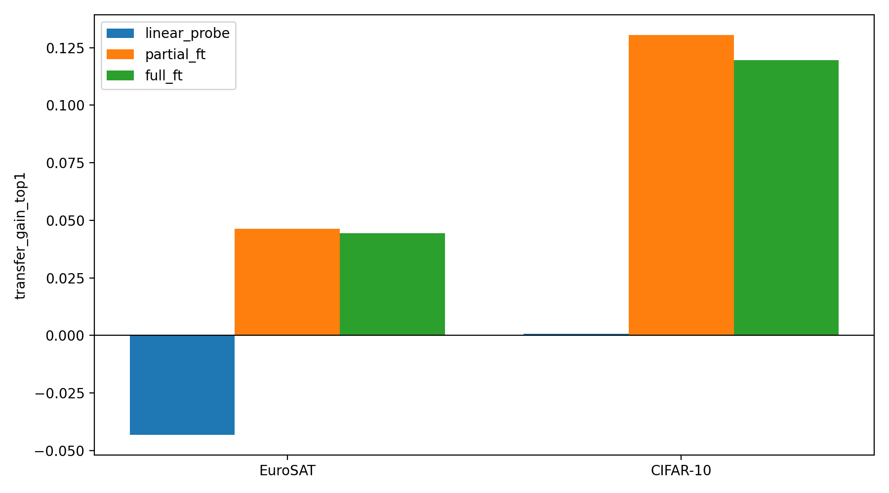
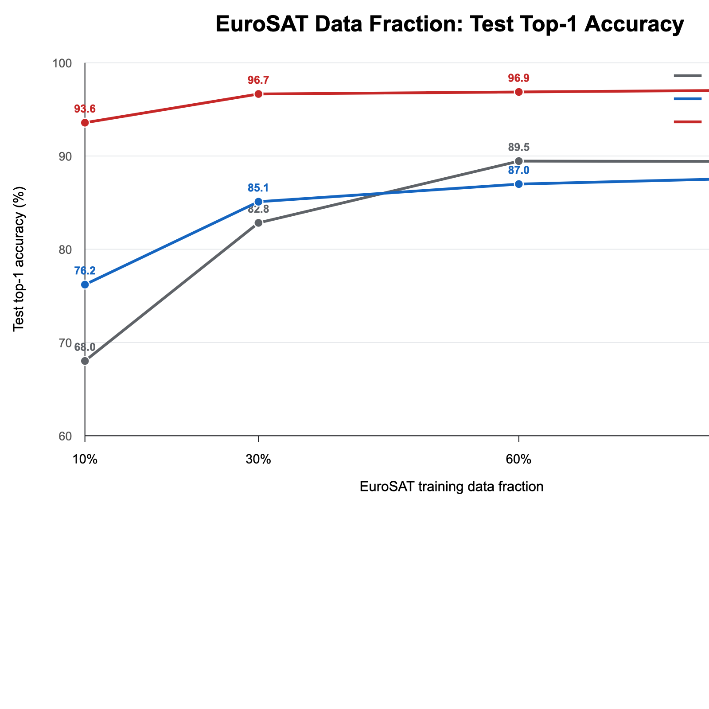
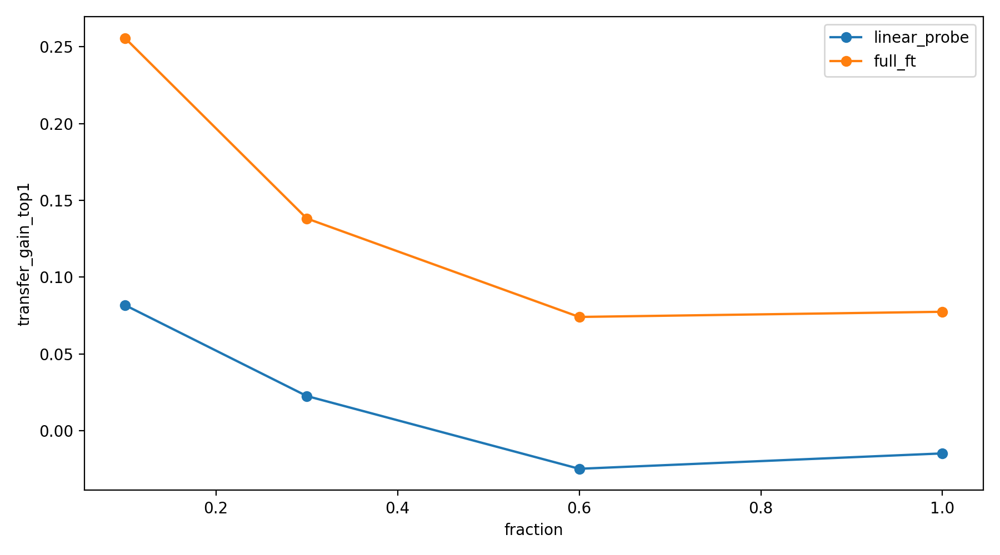
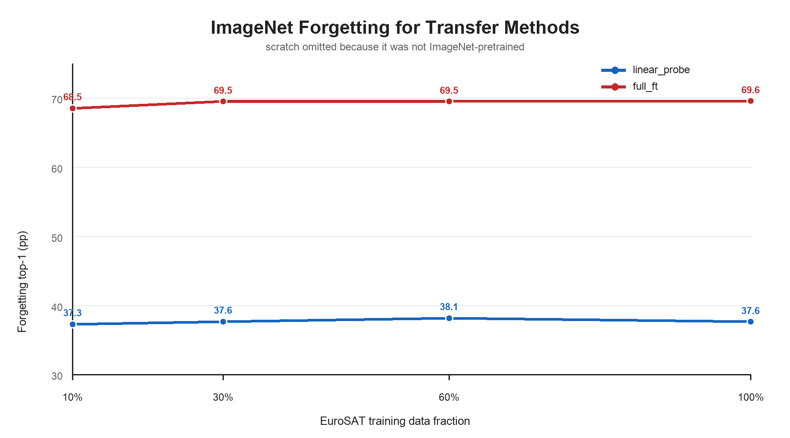
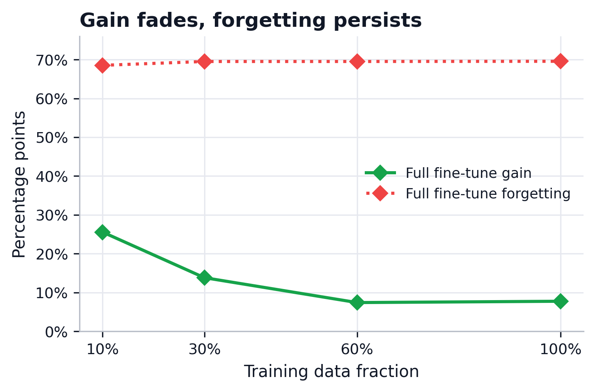

## From ImageNet to EuroSAT: Transfer Learning, Forgetting, and When Transfer Helps

### 0. Project Information

#### AI Use Declaration

AI tools were used as supporting aids for code review, result checking, and language refinement. All experimental design, code execution, interpretation of results, and final report decisions were completed and verified by the group members.

#### Group Contribution

| Member | Main Responsibility |
| --- |---------------------|
| Ruiquan Qiao | TBD                 |
| Tiancheng Xia | TBD                 |
| Guangde Shi | TBD                 |

#### Source Code

The source code and experiment artifacts are available at: `<https://github.com/RuiquanQiao/COMP6242-group-project>`.

### 1. Introduction

Transfer learning is a practical way to adapt deep models to domains where labeled data is limited. In computer vision, ImageNet pretraining is widely used because large-scale supervised training provides reusable visual features [1, 2]. However, transfer is not uniformly effective: usefulness depends on the distance between source and target tasks and on how much of the pretrained network is allowed to adapt [1].

This question is important for remote sensing, where satellite scenes differ substantially from natural images in viewpoint, texture, and semantics [3]. Our main task is therefore straightforward: adapt an ImageNet-pretrained ResNet-18 [5, 6] to EuroSAT [4] and determine which transfer strategy works best. We compare four strategies: training from scratch, linear probing, partial fine-tuning, and full fine-tuning.

Around this mainline task, the report addresses two supporting questions required by the project guideline. First, when does transfer help most? We study this through a same-size cross-domain comparison with CIFAR-10 [8] and a same-domain data-size study on EuroSAT. Second, how much original ImageNet ability is lost after downstream adaptation? We answer this with a catastrophic forgetting analysis on the official ILSVRC2012 validation set [2, 7].

The report therefore makes three contributions: a controlled EuroSAT transfer study, an analysis of when transfer helps, and a direct measurement of forgetting on the original ImageNet task.

### 2. Related Work

#### 2.1 Transfer Learning and Fine-Tuning in Deep Vision

Modern vision transfer learning usually starts from ImageNet-pretrained models and adapts them through feature extraction or fine-tuning. Yosinski et al. show that lower layers transfer more generally than higher layers and that transfer quality depends on task distance [1]. This directly motivates our comparison of linear probing, partial fine-tuning, and full fine-tuning. ImageNet itself remains the standard source task because of its scale and influence on visual representation learning [2, 6].

#### 2.2 Remote Sensing Scene Classification Under Domain Shift

Remote sensing scene classification differs from natural-image recognition because classes are defined by large-scale spatial patterns rather than object-centric appearance [3]. EuroSAT is a standard benchmark in this setting, containing 27,000 labeled Sentinel-2 image patches from 10 classes [4]. This makes it a suitable test bed for asking whether ImageNet representations remain useful under a clear domain shift.

#### 2.3 Catastrophic Forgetting and Sequential Adaptation

Catastrophic forgetting refers to performance loss on a previous task after training on a new one [7]. Methods such as EWC [9] and Learning without Forgetting [10] aim to reduce this effect, but our goal is simpler: measure how much forgetting ordinary downstream fine-tuning already causes. By evaluating on the official ImageNet validation set before and after adaptation, we tie forgetting directly to the actual source task rather than to a proxy benchmark.

### 3. Experimental Setup

#### 3.1 Backbone and Initialization

All experiments use ResNet-18 [5]. Transfer runs start from the official torchvision ImageNet-1K weights, while training from scratch uses random initialization. The final layer is replaced with a 10-way classifier for EuroSAT and CIFAR-10, and the original 1000-way head is restored for ImageNet forgetting evaluation. We compare four strategies: training from scratch, linear probing, partial fine-tuning, and full fine-tuning. For the 10-class downstream tasks, their trainable parameter counts are 11,181,642, 5,130, 8,398,858, and 11,181,642 respectively.

#### 3.2 Datasets and Splits

The main downstream dataset is EuroSAT [4], using a fixed class-balanced split of 27,000 RGB images into 18,900 train, 4,050 validation, and 4,050 test samples. The same split sizes are used for the CIFAR-10 same-size comparison [8]. For the data-size analysis, the EuroSAT validation and test splits stay fixed while the training set is reduced to 10%, 30%, 60%, and 100% of the full training pool. For forgetting, the previous task is the original ImageNet-1K problem [2, 6], evaluated on the official ILSVRC2012 validation set prepared in ImageFolder format.

#### 3.3 Preprocessing and Data Loading

All inputs are resized to 224 x 224. EuroSAT and CIFAR-10 training use resize, random horizontal flip, random rotation, tensor conversion, and ImageNet normalization; validation and test use deterministic resize plus the same normalization. ImageNet forgetting evaluation follows the standard resize-center-crop pipeline. Whenever a subset of a split is requested, sampling is class balanced.

#### 3.4 Training Protocol and Metrics

Unless overridden, all runs use the shared `configs/base.yaml` settings: seed 42, batch size 32, 8 epochs, AdamW, learning rate 3e-4, and weight decay 1e-4. The best checkpoint is selected by validation top-1 accuracy. Top-1 accuracy is the primary metric throughout the report because all downstream tasks are single-label classification tasks with balanced sampling. Macro-F1 is reported as a secondary check of class-balanced performance in the main strategy and domain-gap experiments. The data-size experiments focus on top-1 trends for compactness. Transfer gain is computed against the training-from-scratch baseline, and forgetting is measured as the ImageNet performance drop after downstream adaptation. Loss curves are used only as diagnostic evidence for training stability.

#### 3.5 Experiment Structure

The study has one main experiment and two supporting analyses. Section 4.1 compares four transfer strategies on EuroSAT. Section 4.2 studies when transfer helps by comparing EuroSAT and CIFAR-10 at the same sample size. Section 4.3 studies when transfer helps by varying the amount of EuroSAT training data. Chapter 5 then evaluates the resulting checkpoints on the official ImageNet validation set to measure catastrophic forgetting.

### 4. Experiments and Results

#### 4.1 Main Experiment: EuroSAT Strategy Ablation

Section 4.1 asks the core question of the project: on EuroSAT, does ImageNet pretraining help ResNet-18, and which transfer strategy works best? We compare training from scratch, linear probing, partial fine-tuning, and full fine-tuning under the same training budget.

| Strategy | Test Top-1 | Test Macro-F1 | Transfer Gain Top-1 | Train Time (s) | Trainable Params |
| --- | ---: | ---: | ---: | ---: | ---: |
| Training from scratch | 93.21 | 93.04 | - | 1100.5 | 11,181,642 |
| Linear probing | 88.54 | 88.33 | -4.67 | 560.2 | 5,130 |
| Partial fine-tuning | **97.78** | **97.71** | **+4.57** | 641.2 | 8,398,858 |
| Full fine-tuning | 97.56 | 97.50 | +4.35 | 1068.3 | 11,181,642 |

The results show that transfer is helpful only when the pretrained model is allowed to adapt. Partial fine-tuning gives the best test performance, with full fine-tuning close behind, while linear probing is worst and even falls below the training-from-scratch baseline.

Partial fine-tuning is also the best trade-off overall. It slightly outperforms full fine-tuning on the test set while using fewer trainable parameters and less training time, suggesting that adapting the top stage is sufficient for most of the domain shift. The convergence logs tell the same story: partial fine-tuning and full fine-tuning pass the 90% validation threshold in epoch 1, whereas training from scratch reaches it in epoch 6 and linear probing only in epoch 8.

<table>
  <tr>
    <td width="50%" align="center">
      
    </td>
    <td width="50%" align="center">
      
    </td>
  </tr>
  <tr>
    <td align="center"><em>(a) Final EuroSAT test top-1 accuracy by strategy.</em></td>
    <td align="center"><em>(b) Validation top-1 accuracy across training epochs.</em></td>
  </tr>
</table>

*Figure 1. Side-by-side summary of Experiment 4.1. The left panel shows final EuroSAT test top-1 accuracy, while the right panel shows validation top-1 trajectories. Together they show that partial fine-tuning and full fine-tuning both outperform training from scratch and linear probing, and that deeper fine-tuning converges faster.*

Overall, the EuroSAT ablation shows that transfer is beneficial only when the backbone is allowed to adapt. Linear probing is insufficient for this domain shift, while partial fine-tuning gives the strongest accuracy-efficiency trade-off.

#### 4.2 When Transfer Helps: Same-Size Cross-Domain Comparison

This section compares EuroSAT and CIFAR-10 under the same sample budget in order to isolate the role of source-target domain similarity. Both datasets use 18,900 training, 4,050 validation, and 4,050 test samples, so the main difference is the target domain rather than the amount of supervision. EuroSAT represents a remote-sensing scene classification task with a clear shift from ImageNet, while CIFAR-10 remains closer to natural-image object recognition.

| Dataset | Strategy | Test Top-1 | Test Macro-F1 | Transfer Gain Top-1 |
| --- | --- | ---: | ---: | ---: |
| EuroSAT | Training from scratch | 92.86 | 92.67 | - |
| EuroSAT | Linear probing | 88.54 | 88.33 | -4.32 |
| EuroSAT | Partial fine-tuning | **97.51** | **97.41** | **+4.64** |
| EuroSAT | Full fine-tuning | 97.31 | 97.25 | +4.44 |
| CIFAR-10 | Training from scratch | 78.12 | 78.27 | - |
| CIFAR-10 | Linear probing | 78.20 | 78.00 | +0.07 |
| CIFAR-10 | Partial fine-tuning | **91.19** | **91.18** | **+13.06** |
| CIFAR-10 | Full fine-tuning | 90.07 | 90.03 | +11.95 |

The same-size comparison preserves the main pattern from Section 4.1: transfer works best when the pretrained backbone is allowed to adapt. On EuroSAT, partial fine-tuning and full fine-tuning improve test accuracy over training from scratch by 4.64 and 4.44 percentage points respectively, while linear probing falls below the training-from-scratch baseline. On CIFAR-10, the gains from partial fine-tuning and full fine-tuning are larger, at 13.06 and 11.95 points over training from scratch.

This comparison separates absolute accuracy from transfer benefit. EuroSAT reaches higher final accuracy, but CIFAR-10 receives the larger gain over training from scratch. The broader implications of this domain difference are discussed in Chapter 6.

<table>
  <tr>
    <td width="50%" align="center">
      
    </td>
    <td width="50%" align="center">
      
    </td>
  </tr>
  <tr>
    <td align="center"><em>(a) Test top-1 accuracy by dataset and strategy.</em></td>
    <td align="center"><em>(b) Top-1 transfer gain over training from scratch.</em></td>
  </tr>
</table>

*Figure 2. Same-size cross-domain comparison. The left panel shows downstream test top-1 accuracy, while the right panel shows transfer gain over training from scratch. CIFAR-10 receives a larger gain from ImageNet transfer than EuroSAT.*

#### 4.3 When Transfer Helps: Same-Domain Data-Size Comparison

This section varies the amount of EuroSAT training data in order to study whether transfer becomes more valuable in lower-data regimes. The model and target domain are fixed, while the EuroSAT training fraction is changed from 10% to 30%, 60%, and 100%. We compare training from scratch, linear probing, and full fine-tuning to represent no transfer, frozen-feature transfer, and full adaptation. Because this experiment focuses on how performance changes with training-set size, we report top-1 accuracy and top-1 transfer gain as the primary trend metrics.

| Train Fraction | Training from Scratch Top-1 | Linear Probing Top-1 | Full Fine-Tuning Top-1 | Full Fine-Tuning Gain |
| ---: | ---: | ---: | ---: | ---: |
| 10% | 68.02 | 76.20 | **93.58** | +25.56 |
| 30% | 82.83 | 85.10 | **96.65** | +13.82 |
| 60% | 89.46 | 86.99 | **96.88** | +7.41 |
| 100% | 89.39 | 87.93 | **97.15** | +7.75 |

<table>
  <tr>
    <td width="50%" align="center">
      
    </td>
    <td width="50%" align="center">
      
    </td>
  </tr>
  <tr>
    <td align="center"><em>(a) Test top-1 accuracy by training fraction.</em></td>
    <td align="center"><em>(b) Transfer gain over training from scratch.</em></td>
  </tr>
</table>

*Figure 3. Same-domain data-size comparison. Full fine-tuning performs best at every training fraction, while its transfer gain is largest in the 10% low-data setting.*

The results show that transfer is most valuable when labelled data is limited. With only 10% of the EuroSAT training set, full fine-tuning improves over training from scratch by 25.56 percentage points. As the training fraction increases, the model trained from scratch becomes stronger, and the gain from full fine-tuning decreases to about 7-8 points. This shows that transfer mainly improves sample efficiency in this setting.

Linear probing helps at 10% and 30% data, but it becomes worse than training from scratch at 60% and 100%. The data-size trend shows that transfer is most valuable in the low-data regime; as more EuroSAT labels are available, training from scratch becomes stronger and the relative gain from full fine-tuning decreases.

### 5. Catastrophic Forgetting Analysis

Chapter 5 returns each downstream-adapted model to the official ILSVRC2012 validation set and measures how much of the original ImageNet capability has been lost after fine-tuning. Rather than introducing a new task, this chapter serves as a direct post-test for Chapter 4: Chapter 4 asks how well the model learns EuroSAT, while Chapter 5 asks how much ImageNet performance is forgotten in the process.

#### 5.1 Forgetting After the Main EuroSAT Experiment

We evaluate the linear probing, partial fine-tuning, and full fine-tuning checkpoints from Section 4.1 on the official ILSVRC2012 validation set. The original ImageNet-pretrained ResNet-18 obtains 69.76% top-1 accuracy and 69.30 macro-F1 before downstream adaptation. For each strategy, forgetting is measured as the drop from this baseline to the EuroSAT-adapted model evaluated back on ImageNet. Training from scratch is excluded because it does not start from ImageNet-pretrained weights.

| Strategy | ImageNet After Top-1 | Forgetting Top-1 | ImageNet After Macro-F1 | Forgetting Macro-F1 | EuroSAT Test Top-1 |
| --- | ---: | ---: | ---: | ---: | ---: |
| Linear probing | 32.03 | 37.73 | 33.87 | 35.43 | 88.54 |
| Partial fine-tuning | 0.50 | 69.26 | 0.24 | 69.06 | **97.78** |
| Full fine-tuning | 0.12 | 69.64 | 0.02 | 69.27 | 97.56 |

The main forgetting experiment reveals a clear adaptation-retention trade-off. Linear probing preserves more source-task ability, while partial fine-tuning and full fine-tuning achieve higher EuroSAT accuracy but almost eliminate ImageNet performance.

#### 5.2 Forgetting After the Same-Size Cross-Domain Experiment

This section studies whether forgetting differs between EuroSAT and CIFAR-10 when the downstream sample budget is matched. For each pretrained strategy from Section 4.2, we evaluate the adapted backbone on the official ImageNet validation set and compare it with the original torchvision ResNet-18 baseline. Training from scratch is excluded because it was not initialized from ImageNet.

| Dataset | Strategy | ImageNet After Top-1 | Forgetting Top-1 | ImageNet After Macro-F1 | Forgetting Macro-F1 | Downstream Test Top-1 |
| --- | --- | ---: | ---: | ---: | ---: | ---: |
| CIFAR-10 | Linear probing | 28.53 | 41.23 | 30.40 | 38.90 | 78.20 |
| CIFAR-10 | Partial fine-tuning | 0.59 | 69.17 | 0.35 | 68.95 | **91.19** |
| CIFAR-10 | Full fine-tuning | 0.23 | 69.53 | 0.09 | 69.21 | 90.07 |
| EuroSAT | Linear probing | 32.03 | 37.73 | 33.87 | 35.43 | 88.54 |
| EuroSAT | Partial fine-tuning | 0.23 | 69.53 | 0.07 | 69.23 | **97.51** |
| EuroSAT | Full fine-tuning | 0.13 | 69.63 | 0.03 | 69.27 | 97.31 |

The forgetting results follow the same strategy-level pattern as Section 5.1. Partial fine-tuning and full fine-tuning obtain the strongest downstream accuracy, but both reduce ImageNet top-1 accuracy from 69.76% to below 1% on both downstream datasets. Linear probing retains more ImageNet performance because the backbone remains frozen, but it is also the weakest pretrained strategy on the downstream tasks.

The domain-gap forgetting results show that a downstream task being closer to ImageNet does not prevent forgetting after fine-tuning. CIFAR-10 receives larger transfer gains than EuroSAT, but fine-tuning on either dataset still severely damages ImageNet performance.

<table>
  <tr>
    <td width="50%" align="center">
      
    </td>
    <td width="50%" align="center">
      
    </td>
  </tr>
  <tr>
    <td align="center"><em>(a) ImageNet top-1 forgetting.</em></td>
    <td align="center"><em>(b) ImageNet macro-F1 forgetting.</em></td>
  </tr>
</table>

*Figure 4. Forgetting after same-size downstream adaptation. Fine-tuning causes much larger ImageNet forgetting than linear probing on both EuroSAT and CIFAR-10. Macro-F1 forgetting is shown as a secondary check of the same pattern.*

#### 5.3 Forgetting After the Data-Size Experiment

This section evaluates how forgetting changes as the amount of EuroSAT downstream data increases. Combined with Section 4.3, it allows the report to analyze the trade-off between improved downstream adaptation and greater modification of the pretrained representation. The original ImageNet-pretrained ResNet-18 obtains 69.76% top-1 accuracy before EuroSAT adaptation, and forgetting is measured as `A_before - A_after`. For consistency with Section 4.3, this section focuses on top-1 forgetting across training fractions.

| Train Fraction | Strategy | ImageNet After Top-1 | Forgetting Top-1 | EuroSAT Top-1 |
| ---: | --- | ---: | ---: | ---: |
| 10% | Linear probing | 32.50 | 37.26 | 76.20 |
| 10% | Full fine-tuning | 1.24 | 68.52 | 93.58 |
| 30% | Linear probing | 32.11 | 37.65 | 85.10 |
| 30% | Full fine-tuning | 0.25 | 69.51 | 96.65 |
| 60% | Linear probing | 31.62 | 38.14 | 86.99 |
| 60% | Full fine-tuning | 0.25 | 69.51 | 96.88 |
| 100% | Linear probing | 32.13 | 37.63 | 87.93 |
| 100% | Full fine-tuning | 0.20 | 69.56 | 97.15 |

<table>
  <tr>
    <td width="50%" align="center">
      
    </td>
    <td width="50%" align="center">
      
    </td>
  </tr>
  <tr>
    <td align="center"><em>(a) ImageNet top-1 forgetting by transfer method.</em></td>
    <td align="center"><em>(b) Transfer gain and forgetting trade-off.</em></td>
  </tr>
</table>

*Figure 5. Forgetting after the data-size experiment. Full fine-tuning gives the strongest EuroSAT adaptation, but it also causes much larger ImageNet forgetting than linear probing.*

The main result is that forgetting depends more on the training strategy than on the amount of EuroSAT data. Full fine-tuning forgets heavily at every data size: ImageNet top-1 drops from 69.76% to about 0.20%-1.24%, meaning that the adapted backbone is no longer compatible with the original ImageNet classifier.

Linear probing preserves more ImageNet ability. Its ImageNet top-1 stays around 31%-32%, giving about 37-38 points of forgetting. The data-size forgetting results show that forgetting is driven more by the fine-tuning strategy than by the amount of EuroSAT data: full fine-tuning forgets heavily at every data fraction, while linear probing preserves more ImageNet accuracy but gives lower EuroSAT performance.

### 6. Discussion

The experimental findings suggest several explanations for when transfer helps and why catastrophic forgetting occurs.

Linear probing performs poorly on EuroSAT because the fixed ImageNet representation is not directly aligned with remote-sensing scene categories. EuroSAT classes rely on overhead texture, land-cover patterns, and spatial layout, while ImageNet features are learned from object-centric natural images. This explains why freezing the entire backbone protects the source representation but does not give the best downstream performance.

Partial fine-tuning likely works well because it updates higher-level features while preserving lower-level filters. This gives the model enough flexibility to adapt to the EuroSAT domain without changing the whole network as aggressively as full fine-tuning. Under the short training budget used here, the extra flexibility of full fine-tuning does not produce a clear EuroSAT advantage over partial fine-tuning.

The CIFAR-10 comparison also shows why absolute accuracy and transfer gain need to be separated. CIFAR-10 has lower absolute accuracy than EuroSAT, but larger transfer gain. This is not contradictory: EuroSAT may be easier under the current split and preprocessing, so both training from scratch and fine-tuned models reach high accuracy. CIFAR-10 remains harder in absolute terms, but ImageNet pretraining gives a larger relative improvement because it shares more natural-image structure with ImageNet.

The data-size results reflect the same principle from another angle. When EuroSAT labels are limited, training from scratch cannot learn robust features as effectively, so pretrained features provide a large advantage. As the training set grows, the training-from-scratch baseline improves and the relative benefit of transfer becomes smaller.

Catastrophic forgetting arises because fine-tuning updates the backbone toward a new 10-class objective. Without any explicit constraint to preserve ImageNet performance, these updates make the feature extractor less compatible with the original 1000-class ImageNet classifier. Linear probing forgets less because it freezes the pretrained backbone and only learns the downstream classification head. Since the forgetting evaluation reloads the adapted backbone into the ImageNet classifier, a mostly unchanged backbone remains more compatible with the original ImageNet task. The cost is weaker downstream performance because the representation cannot adapt deeply to EuroSAT or CIFAR-10.

The main limitation is that these experiments use a single architecture, one random seed, and a short fixed training budget. We also measure forgetting directly through ImageNet re-evaluation, but we do not test mitigation methods such as regularization, rehearsal, or freezing additional layers.

### 7. Conclusion

This project shows that ImageNet transfer can substantially improve EuroSAT classification, but only when the pretrained backbone is allowed to adapt. Partial fine-tuning gives the best overall balance of accuracy, efficiency, and source-task retention among the tested strategies.

Transfer is most useful when labelled target data are limited or when the target domain is closer to ImageNet. However, stronger adaptation also causes severe catastrophic forgetting on the original ImageNet task. Future work should therefore focus on mitigation methods that preserve source-task performance while retaining the downstream gains of fine-tuning.

### 8. References

[1] J. Yosinski, J. Clune, Y. Bengio, and H. Lipson, "How Transferable Are Features in Deep Neural Networks?," in *Advances in Neural Information Processing Systems 27*, 2014, pp. 3320-3328.

[2] O. Russakovsky, J. Deng, H. Su, J. Krause, S. Satheesh, S. Ma, Z. Huang, A. Karpathy, A. Khosla, M. Bernstein, A. C. Berg, and L. Fei-Fei, "ImageNet Large Scale Visual Recognition Challenge," *International Journal of Computer Vision*, vol. 115, no. 3, pp. 211-252, 2015. doi: 10.1007/s11263-015-0816-y.

[3] G. Cheng, X. Xie, J. Han, L. Guo, and G.-S. Xia, "Remote Sensing Image Scene Classification Meets Deep Learning: Challenges, Methods, Benchmarks, and Opportunities," *IEEE Journal of Selected Topics in Applied Earth Observations and Remote Sensing*, vol. 13, pp. 3735-3756, 2020. doi: 10.1109/JSTARS.2020.3005403.

[4] P. Helber, B. Bischke, A. Dengel, and D. Borth, "EuroSAT: A Novel Dataset and Deep Learning Benchmark for Land Use and Land Cover Classification," *IEEE Journal of Selected Topics in Applied Earth Observations and Remote Sensing*, vol. 12, no. 7, pp. 2217-2226, 2019. doi: 10.1109/JSTARS.2019.2918242.

[5] K. He, X. Zhang, S. Ren, and J. Sun, "Deep Residual Learning for Image Recognition," in *Proceedings of the IEEE Conference on Computer Vision and Pattern Recognition*, 2016, pp. 770-778. doi: 10.1109/CVPR.2016.90.

[6] J. Deng, W. Dong, R. Socher, L.-J. Li, K. Li, and L. Fei-Fei, "ImageNet: A Large-Scale Hierarchical Image Database," in *Proceedings of the IEEE Conference on Computer Vision and Pattern Recognition*, 2009, pp. 248-255. doi: 10.1109/CVPR.2009.5206848.

[7] I. J. Goodfellow, M. Mirza, X. Da, A. Courville, and Y. Bengio, "An Empirical Investigation of Catastrophic Forgetting in Gradient-Based Neural Networks," arXiv:1312.6211, 2013.

[8] A. Krizhevsky, "Learning Multiple Layers of Features from Tiny Images," Technical Report, University of Toronto, 2009.

[9] J. Kirkpatrick, R. Pascanu, N. Rabinowitz, J. Veness, G. Desjardins, A. A. Rusu, K. Milan, J. Quan, T. Ramalho, A. Grabska-Barwinska, D. Hassabis, C. Clopath, D. Kumaran, and R. Hadsell, "Overcoming Catastrophic Forgetting in Neural Networks," *Proceedings of the National Academy of Sciences*, vol. 114, no. 13, pp. 3521-3526, 2017. doi: 10.1073/pnas.1611835114.

[10] Z. Li and D. Hoiem, "Learning Without Forgetting," in *European Conference on Computer Vision*, 2016, pp. 614-629. doi: 10.1007/978-3-319-46493-0_37.

