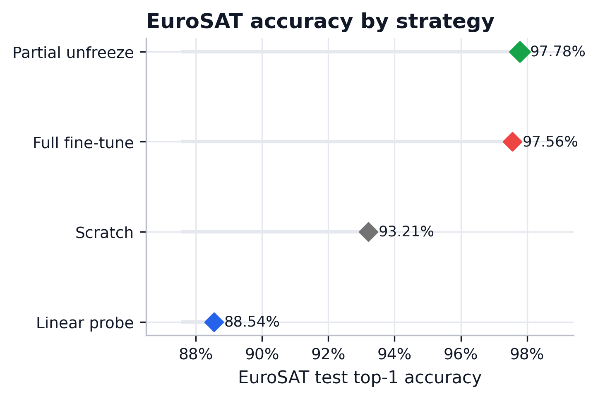
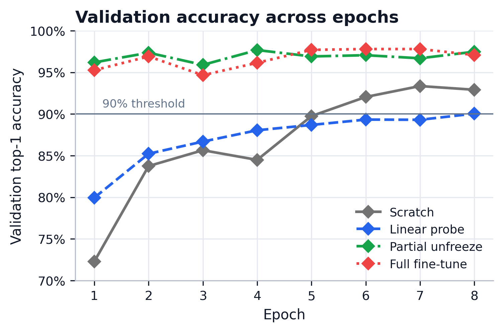
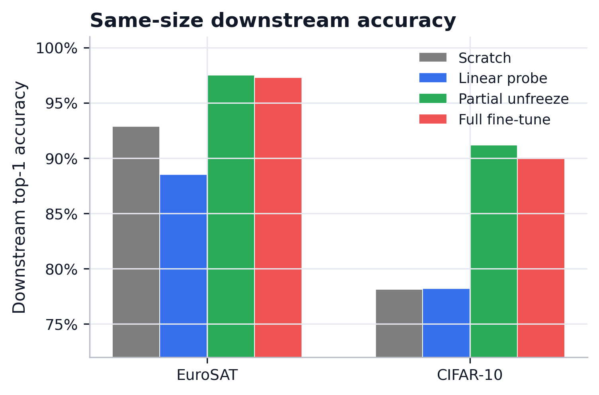
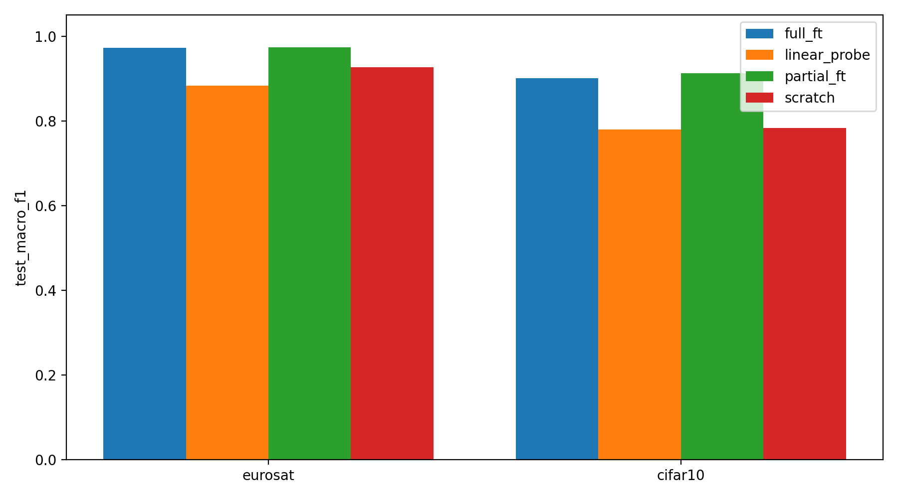
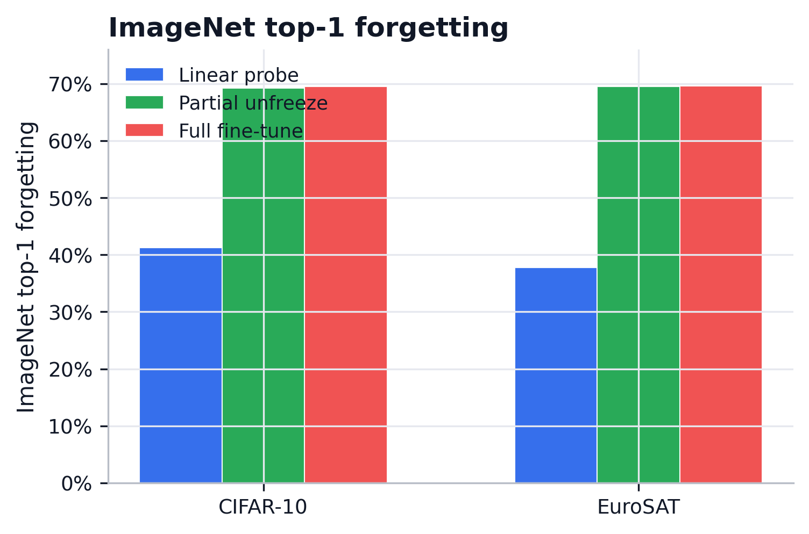
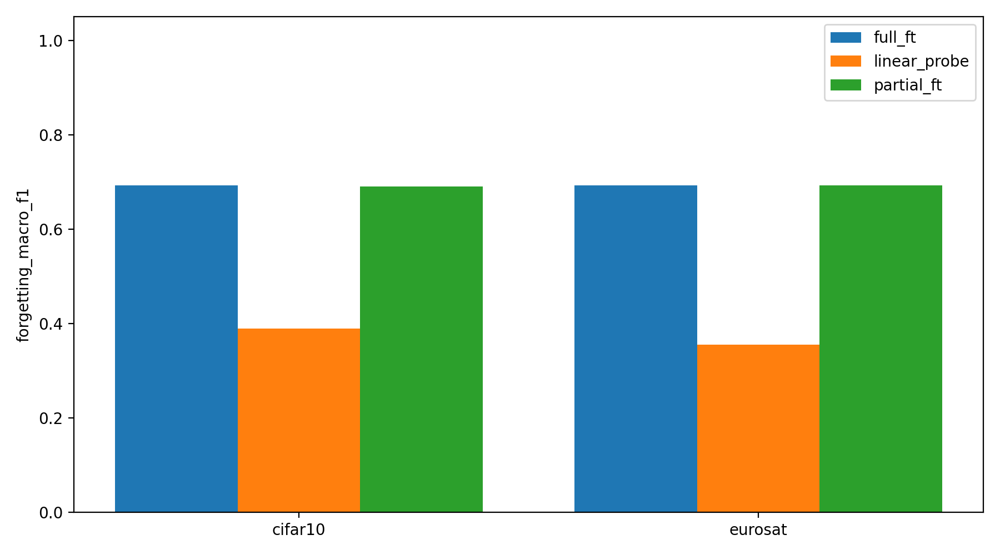

## From ImageNet to EuroSAT: Transfer Learning, Forgetting, and When Transfer Helps

### 0. Project Information

#### AI Use Declaration

AI tools were used to assist with code understanding, experiment-result summarisation, report drafting, and language polishing. All experimental design choices, code execution, result verification, and final report content were reviewed and approved by the group members.

#### Group Contribution

| Member | Main Responsibility |
| --- |---------------------|
| Ruiquan Qiao | TBD                 |
| Tiancheng Xia | TBD                 |
| Guangde Shi | TBD                 |

#### Source Code

The source code and experiment artifacts are available at: `<GitHub repository URL>`.

### 1. Introduction

Transfer learning is a practical way to adapt deep models to domains where labeled data is limited. In computer vision, ImageNet pretraining is widely used because large-scale supervised training provides reusable visual features [1, 2]. However, transfer is not uniformly effective: usefulness depends on the distance between source and target tasks and on how much of the pretrained network is allowed to adapt [1].

This question is important for remote sensing, where satellite scenes differ substantially from natural images in viewpoint, texture, and semantics [3]. Our main task is therefore straightforward: adapt an ImageNet-pretrained ResNet-18 [5, 6] to EuroSAT [4] and determine which transfer strategy works best. We compare four strategies: `scratch`, `linear_probe`, `partial_ft`, and `full_ft`.

Around this mainline task, the report addresses two supporting questions required by the project guideline. First, when does transfer help most? We study this through a same-size cross-domain comparison with CIFAR-10 [8] and a same-domain data-size study on EuroSAT. Second, how much original ImageNet ability is lost after downstream adaptation? We answer this with a catastrophic forgetting analysis on the official ILSVRC2012 validation set [2, 7].

The report therefore makes three contributions: a controlled EuroSAT transfer study, an analysis of when transfer helps, and a direct measurement of forgetting on the original ImageNet task.

### 2. Related Work

#### 2.1 Transfer Learning and Fine-Tuning in Deep Vision

Modern vision transfer learning usually starts from ImageNet-pretrained models and adapts them through feature extraction or fine-tuning. Yosinski et al. show that lower layers transfer more generally than higher layers and that transfer quality depends on task distance [1]. This directly motivates our comparison of `linear_probe`, `partial_ft`, and `full_ft`. ImageNet itself remains the standard source task because of its scale and influence on visual representation learning [2, 6].

#### 2.2 Remote Sensing Scene Classification Under Domain Shift

Remote sensing scene classification differs from natural-image recognition because classes are defined by large-scale spatial patterns rather than object-centric appearance [3]. EuroSAT is a standard benchmark in this setting, containing 27,000 labeled Sentinel-2 image patches from 10 classes [4]. This makes it a suitable test bed for asking whether ImageNet representations remain useful under a clear domain shift.

#### 2.3 Catastrophic Forgetting and Sequential Adaptation

Catastrophic forgetting refers to performance loss on a previous task after training on a new one [7]. Methods such as EWC [9] and Learning without Forgetting [10] aim to reduce this effect, but our goal is simpler: measure how much forgetting ordinary downstream fine-tuning already causes. By evaluating on the official ImageNet validation set before and after adaptation, we tie forgetting directly to the actual source task rather than to a proxy benchmark.

### 3. Experimental Setup

#### 3.1 Backbone and Initialization

All experiments use ResNet-18 [5]. Transfer runs start from the official torchvision ImageNet-1K weights, while `scratch` uses random initialization. The final layer is replaced with a 10-way classifier for EuroSAT and CIFAR-10, and the original 1000-way head is restored for ImageNet forgetting evaluation. We compare four strategies: `scratch`, `linear_probe`, `partial_ft`, and `full_ft`. For the 10-class downstream tasks, their trainable parameter counts are 11,181,642, 5,130, 8,398,858, and 11,181,642 respectively.

#### 3.2 Datasets and Splits

The main downstream dataset is EuroSAT [4], using a fixed class-balanced split of 27,000 RGB images into 18,900 train, 4,050 validation, and 4,050 test samples. The same split sizes are used for the CIFAR-10 same-size comparison [8]. For the data-size analysis, the EuroSAT validation and test splits stay fixed while the training set is reduced to 10%, 30%, 60%, and 100% of the full training pool. For forgetting, the previous task is the original ImageNet-1K problem [2, 6], evaluated on the official ILSVRC2012 validation set prepared in ImageFolder format.

#### 3.3 Preprocessing and Data Loading

All inputs are resized to 224 x 224. EuroSAT and CIFAR-10 training use resize, random horizontal flip, random rotation, tensor conversion, and ImageNet normalization; validation and test use deterministic resize plus the same normalization. ImageNet forgetting evaluation follows the standard resize-center-crop pipeline. Whenever a subset of a split is requested, sampling is class balanced.

#### 3.4 Training Protocol and Metrics

Unless overridden, all runs use the shared `configs/base.yaml` settings: seed 42, batch size 32, 8 epochs, AdamW, learning rate 3e-4, and weight decay 1e-4. The best checkpoint is selected by validation top-1 accuracy. We report test top-1 accuracy, test macro-F1, training time, and convergence behavior. In Chapter 5, forgetting is defined as the drop in ImageNet top-1 accuracy or macro-F1 after downstream fine-tuning.

#### 3.5 Experiment Structure

The study has one main experiment and two supporting analyses. Section 4.1 compares four transfer strategies on EuroSAT. Section 4.2 studies when transfer helps by comparing EuroSAT and CIFAR-10 at the same sample size. Section 4.3 studies when transfer helps by varying the amount of EuroSAT training data. Chapter 5 then evaluates the resulting checkpoints on the official ImageNet validation set to measure catastrophic forgetting.

### 4. Experiments and Results

#### 4.1 Main Experiment: EuroSAT Strategy Ablation

Section 4.1 asks the core question of the project: on EuroSAT, does ImageNet pretraining help ResNet-18, and which transfer strategy works best? We compare `scratch`, `linear_probe`, `partial_ft`, and `full_ft` under the same training budget. The table below reflects the current pre-fix run; the final report should refresh these numbers after regenerating checkpoints with frozen BatchNorm drift fixed.

| Strategy | Best Val Top-1 | Test Top-1 | Test Macro-F1 | Train Time (s) | Trainable Params |
| --- | ---: | ---: | ---: | ---: | ---: |
| `scratch` | 93.36 | 93.21 | 93.04 | 1100.5 | 11,181,642 |
| `linear_probe` | 90.05 | 88.54 | 88.33 | 560.2 | 5,130 |
| `partial_ft` | 97.68 | **97.78** | **97.71** | 641.2 | 8,398,858 |
| `full_ft` | **97.80** | 97.56 | 97.50 | 1068.3 | 11,181,642 |

In the current pre-fix run, transfer is helpful only when the pretrained model is allowed to adapt. `partial_ft` gives the best test performance, with `full_ft` close behind, while `linear_probe` is worst and even falls below the scratch baseline. These numbers should be treated as provisional until the BN-fix rerun is completed.

`partial_ft` is also the best trade-off overall. It slightly outperforms `full_ft` on the test set while using fewer trainable parameters and less training time, suggesting that adapting the top stage is sufficient for most of the domain shift. The convergence logs tell the same story: `partial_ft` and `full_ft` pass the 90% validation threshold in epoch 1, whereas `scratch` reaches it in epoch 6 and `linear_probe` only in epoch 8.

<table>
  <tr>
    <td width="50%" align="center">
      
    </td>
    <td width="50%" align="center">
      
    </td>
  </tr>
  <tr>
    <td align="center"><em>(a) Final EuroSAT test top-1 accuracy by strategy.</em></td>
    <td align="center"><em>(b) Validation top-1 accuracy across training epochs.</em></td>
  </tr>
</table>

*Figure 1. Side-by-side summary of Experiment 4.1. The left panel shows final EuroSAT test top-1 accuracy, while the right panel shows validation top-1 trajectories. Together they show that `partial_ft` and `full_ft` both outperform `scratch` and `linear_probe`, and that deeper fine-tuning converges faster.*

Overall, Experiment 4.1 shows that ImageNet transfer improves EuroSAT classification, but the best result comes from selective or full fine-tuning rather than from freezing the backbone. Among the tested strategies, `partial_ft` provides the best balance of accuracy, speed, and efficiency, so it is a strong reference point for the later experiments and forgetting analysis.

#### 4.2 When Transfer Helps: Same-Size Cross-Domain Comparison

This section compares EuroSAT and CIFAR-10 under the same sample budget in order to isolate the role of source-target domain similarity. Both datasets use 18,900 training, 4,050 validation, and 4,050 test samples, so the main difference is the target domain rather than the amount of supervision. EuroSAT represents a remote-sensing scene classification task with a clear shift from ImageNet, while CIFAR-10 remains closer to natural-image object recognition.

| Dataset | Strategy | Best Val Top-1 | Test Top-1 | Test Macro-F1 | Transfer Gain vs Scratch |
| --- | --- | ---: | ---: | ---: | ---: |
| EuroSAT | `scratch` | 93.75 | 92.86 | 92.67 | - |
| EuroSAT | `linear_probe` | 90.05 | 88.54 | 88.33 | -4.32 |
| EuroSAT | `partial_ft` | **97.70** | **97.51** | **97.41** | +4.64 |
| EuroSAT | `full_ft` | 97.65 | 97.31 | 97.25 | +4.44 |
| CIFAR-10 | `scratch` | 79.31 | 78.12 | 78.27 | - |
| CIFAR-10 | `linear_probe` | 77.98 | 78.20 | 78.00 | +0.07 |
| CIFAR-10 | `partial_ft` | **92.12** | **91.19** | **91.18** | +13.06 |
| CIFAR-10 | `full_ft` | 90.10 | 90.07 | 90.03 | +11.95 |

The same-size comparison preserves the main pattern from Section 4.1: transfer works best when the pretrained backbone is allowed to adapt. On EuroSAT, `partial_ft` and `full_ft` improve test accuracy over scratch by 4.64 and 4.44 percentage points respectively, while `linear_probe` falls below the scratch baseline. On CIFAR-10, the gains from `partial_ft` and `full_ft` are larger, at 13.06 and 11.95 points over scratch.

These results suggest that target-domain properties affect the size of the transfer benefit. CIFAR-10 receives a larger gain from ImageNet initialization than EuroSAT under the same data budget, while EuroSAT still benefits from selective or full fine-tuning. The broader implications of this domain difference are discussed in Chapter 6.

<table>
  <tr>
    <td width="50%" align="center">
      
    </td>
    <td width="50%" align="center">
      
    </td>
  </tr>
  <tr>
    <td align="center"><em>(a) Test top-1 accuracy by dataset and strategy.</em></td>
    <td align="center"><em>(b) Test macro-F1 by dataset and strategy.</em></td>
  </tr>
</table>

*Figure 2. Same-size cross-domain comparison. `partial_ft` and `full_ft` improve both datasets, while the transfer gain is larger on CIFAR-10 than on EuroSAT.*

#### 4.3 When Transfer Helps: Same-Domain Data-Size Comparison

This section varies the amount of EuroSAT training data in order to study whether transfer becomes more valuable in lower-data regimes. The key quantity of interest is transfer gain relative to scratch as the target sample budget increases from 10% to 100% of the full EuroSAT training split.

### 5. Catastrophic Forgetting Analysis

Chapter 5 returns each downstream-adapted model to the official ILSVRC2012 validation set and measures how much of the original ImageNet capability has been lost after fine-tuning. Rather than introducing a new task, this chapter serves as a direct post-test for Chapter 4: Chapter 4 asks how well the model learns EuroSAT, while Chapter 5 asks how much ImageNet performance is forgotten in the process.

#### 5.1 Forgetting After the Main EuroSAT Experiment

We evaluate the `linear_probe`, `partial_ft`, and `full_ft` checkpoints from Section 4.1 on the official ILSVRC2012 validation set. For each strategy, forgetting is measured as the drop from the original ImageNet-pretrained ResNet-18 (`A_before`) to the EuroSAT-adapted model evaluated back on ImageNet (`A_after`). `scratch` is excluded because it does not start from ImageNet-pretrained weights.

| Strategy | ImageNet Before Top-1 | ImageNet After Top-1 | Forgetting Top-1 | ImageNet Before Macro-F1 | ImageNet After Macro-F1 | Forgetting Macro-F1 | EuroSAT Test Top-1 |
| --- | ---: | ---: | ---: | ---: | ---: | ---: | ---: |
| `linear_probe` | 69.76 | 32.03 | 37.73 | 69.30 | 33.87 | 35.43 | 88.54 |
| `partial_ft` | 69.76 | 0.50 | 69.26 | 69.30 | 0.24 | 69.06 | 97.78 |
| `full_ft` | 69.76 | 0.12 | 69.64 | 69.30 | 0.02 | 69.27 | 97.56 |

The results show a clear trade-off between downstream adaptation and source-task retention. `linear_probe` forgets the least, but it is also the weakest EuroSAT strategy. By contrast, `partial_ft` and `full_ft` achieve the best EuroSAT accuracy while losing almost all original ImageNet performance, with `full_ft` showing the largest forgetting overall. In the current main experiment, `partial_ft` remains the best downstream choice, but not because it preserves the source task well; its advantage comes from stronger EuroSAT adaptation despite substantial forgetting.

#### 5.2 Forgetting After the Same-Size Cross-Domain Experiment

This section studies whether forgetting differs between EuroSAT and CIFAR-10 when the downstream sample budget is matched. For each pretrained strategy from Section 4.2, we evaluate the adapted backbone on the official ImageNet validation set and compare it with the original torchvision ResNet-18 baseline. `scratch` is excluded because it was not initialized from ImageNet.

| Dataset | Strategy | ImageNet After Top-1 | Forgetting Top-1 | ImageNet After Macro-F1 | Forgetting Macro-F1 | Downstream Test Top-1 |
| --- | --- | ---: | ---: | ---: | ---: | ---: |
| CIFAR-10 | `linear_probe` | 28.53 | 41.23 | 30.40 | 38.90 | 78.20 |
| CIFAR-10 | `partial_ft` | 0.59 | 69.17 | 0.35 | 68.95 | **91.19** |
| CIFAR-10 | `full_ft` | 0.23 | 69.53 | 0.09 | 69.21 | 90.07 |
| EuroSAT | `linear_probe` | 32.03 | 37.73 | 33.87 | 35.43 | 88.54 |
| EuroSAT | `partial_ft` | 0.23 | 69.53 | 0.07 | 69.23 | **97.51** |
| EuroSAT | `full_ft` | 0.13 | 69.63 | 0.03 | 69.27 | 97.31 |

The forgetting results follow the same strategy-level pattern as Section 5.1. `partial_ft` and `full_ft` obtain the strongest downstream accuracy, but both reduce ImageNet top-1 accuracy from 69.76% to below 1% on both downstream datasets. `linear_probe` retains more ImageNet performance because the backbone remains frozen, but it is also the weakest pretrained strategy on the downstream tasks.

Across the two target datasets, the difference between strategies is larger than the difference between EuroSAT and CIFAR-10. This section therefore reports the observed forgetting pattern, while Chapter 6 connects it with the transfer-gain results from Section 4.2.

<table>
  <tr>
    <td width="50%" align="center">
      
    </td>
    <td width="50%" align="center">
      
    </td>
  </tr>
  <tr>
    <td align="center"><em>(a) ImageNet top-1 forgetting.</em></td>
    <td align="center"><em>(b) ImageNet macro-F1 forgetting.</em></td>
  </tr>
</table>

*Figure 3. Forgetting after same-size downstream adaptation. Fine-tuning causes much larger ImageNet forgetting than linear probing on both EuroSAT and CIFAR-10.*

#### 5.3 Forgetting After the Data-Size Experiment

This section evaluates how forgetting changes as the amount of EuroSAT downstream data increases. Combined with Section 4.3, it allows the report to analyze the trade-off between improved downstream adaptation and greater modification of the pretrained representation.

### 6. Discussion

The main EuroSAT experiment shows that ImageNet pretraining is useful only when the representation is allowed to adapt to the target domain. `linear_probe` trains only 5,130 parameters and keeps the backbone fixed, so it is the fastest strategy, but its test accuracy is lower than scratch. This suggests that the fixed ImageNet features are not sufficiently aligned with EuroSAT scene categories. EuroSAT images are overhead land-cover patches, where class evidence often comes from texture, spatial layout, and surface patterns rather than the object-centric cues emphasized by ImageNet.

`partial_ft` gives the best EuroSAT test accuracy and macro-F1 while using fewer trainable parameters and less training time than `full_ft`. This result suggests that adapting the last ResNet stage is enough to bridge much of the domain shift, while the earlier layers can still provide useful generic visual features. `full_ft` achieves a very similar downstream result, but it updates the whole network and shows slightly larger ImageNet forgetting in Section 5.1. The main experiment therefore supports a practical trade-off: deeper adaptation improves EuroSAT performance, but updating all layers is not clearly necessary under this training budget.

The forgetting results from Section 5.1 clarify the cost of this adaptation. `linear_probe` preserves the most ImageNet ability because the backbone is frozen, but it also gives the weakest EuroSAT performance. `partial_ft` and `full_ft` almost eliminate ImageNet performance after fine-tuning, even though they are the strongest EuroSAT strategies. This indicates that the same feature changes that help the model fit EuroSAT also make the backbone much less compatible with the original ImageNet classifier.

The domain-gap experiment shows that closeness to ImageNet mainly affects the size of the downstream transfer gain, not whether the original ImageNet task is preserved. CIFAR-10 is visually closer to ImageNet than EuroSAT, and this is reflected in Section 4.2: `partial_ft` improves CIFAR-10 accuracy by 13.06 percentage points over scratch, compared with 4.64 points on EuroSAT. This suggests that ImageNet features are more directly reusable for natural-image classification than for remote-sensing scenes.

However, the forgetting results show that this similarity does not protect ImageNet performance after fine-tuning. Even after CIFAR-10 fine-tuning, ImageNet top-1 accuracy drops from 69.76% to 0.59% for `partial_ft` and 0.23% for `full_ft`. This happens because the downstream objective is still very different from the original 1000-class ImageNet task: the classifier is replaced with a 10-class head, the training data are much smaller, and fine-tuning updates high-level features toward the new label space. CIFAR-10 is therefore closer to ImageNet than EuroSAT in image content, but it is not the same task.

This distinction is important for interpreting transfer learning. Domain similarity can make adaptation easier, but ordinary fine-tuning is optimized only for the new task and has no explicit constraint to preserve the old one. In our results, `linear_probe` retains substantially more ImageNet performance because the backbone is frozen, but it also gives weaker downstream accuracy. `partial_ft` and `full_ft` make the opposite trade-off: they adapt well to the downstream task but severely damage the source-task representation.

The main limitation is that these experiments use a single architecture, one random seed, and a short fixed training budget. We also measure forgetting directly through ImageNet re-evaluation, but we do not test mitigation methods such as regularization, rehearsal, or freezing additional layers. Future work could compare these methods to determine whether the strong downstream performance of fine-tuning can be retained while reducing ImageNet forgetting.

### 7. Conclusion

The conclusion summarizes the report's main answers to the three overarching questions: whether transfer helps EuroSAT classification, under what conditions transfer helps most, and how strongly different fine-tuning strategies induce catastrophic forgetting on the original ImageNet task.

### 8. References

[1] J. Yosinski, J. Clune, Y. Bengio, and H. Lipson, "How Transferable Are Features in Deep Neural Networks?," in *Advances in Neural Information Processing Systems 27*, 2014, pp. 3320-3328.

[2] O. Russakovsky, J. Deng, H. Su, J. Krause, S. Satheesh, S. Ma, Z. Huang, A. Karpathy, A. Khosla, M. Bernstein, A. C. Berg, and L. Fei-Fei, "ImageNet Large Scale Visual Recognition Challenge," *International Journal of Computer Vision*, vol. 115, no. 3, pp. 211-252, 2015. doi: 10.1007/s11263-015-0816-y.

[3] G. Cheng, X. Xie, J. Han, L. Guo, and G.-S. Xia, "Remote Sensing Image Scene Classification Meets Deep Learning: Challenges, Methods, Benchmarks, and Opportunities," *IEEE Journal of Selected Topics in Applied Earth Observations and Remote Sensing*, vol. 13, pp. 3735-3756, 2020. doi: 10.1109/JSTARS.2020.3005403.

[4] P. Helber, B. Bischke, A. Dengel, and D. Borth, "EuroSAT: A Novel Dataset and Deep Learning Benchmark for Land Use and Land Cover Classification," *IEEE Journal of Selected Topics in Applied Earth Observations and Remote Sensing*, vol. 12, no. 7, pp. 2217-2226, 2019. doi: 10.1109/JSTARS.2019.2918242.

[5] K. He, X. Zhang, S. Ren, and J. Sun, "Deep Residual Learning for Image Recognition," in *Proceedings of the IEEE Conference on Computer Vision and Pattern Recognition*, 2016, pp. 770-778. doi: 10.1109/CVPR.2016.90.

[6] J. Deng, W. Dong, R. Socher, L.-J. Li, K. Li, and L. Fei-Fei, "ImageNet: A Large-Scale Hierarchical Image Database," in *Proceedings of the IEEE Conference on Computer Vision and Pattern Recognition*, 2009, pp. 248-255. doi: 10.1109/CVPR.2009.5206848.

[7] I. J. Goodfellow, M. Mirza, X. Da, A. Courville, and Y. Bengio, "An Empirical Investigation of Catastrophic Forgetting in Gradient-Based Neural Networks," arXiv:1312.6211, 2013.

[8] A. Krizhevsky, "Learning Multiple Layers of Features from Tiny Images," Technical Report, University of Toronto, 2009.

[9] J. Kirkpatrick, R. Pascanu, N. Rabinowitz, J. Veness, G. Desjardins, A. A. Rusu, K. Milan, J. Quan, T. Ramalho, A. Grabska-Barwinska, D. Hassabis, C. Clopath, D. Kumaran, and R. Hadsell, "Overcoming Catastrophic Forgetting in Neural Networks," *Proceedings of the National Academy of Sciences*, vol. 114, no. 13, pp. 3521-3526, 2017. doi: 10.1073/pnas.1611835114.

[10] Z. Li and D. Hoiem, "Learning Without Forgetting," in *European Conference on Computer Vision*, 2016, pp. 614-629. doi: 10.1007/978-3-319-46493-0_37.
